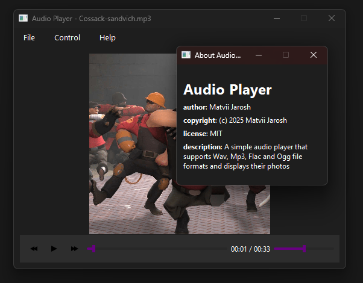

# Audio Player

**Audio Player** — Простий аудіо плеер який підтримує Wav, Mp3, Flac та Ogg 
формати файлів та відображає їхні фото .

## Скриншот

## Встановлення

Перейдіть у розділ **Releases** на **GitHub** і завантажте інсталятор,  
або зберіть програму з вихідного коду.

## Автор

**Matvii Jarosh** matviijarosh@gmail.com

## Ліцензія

**MIT License**
